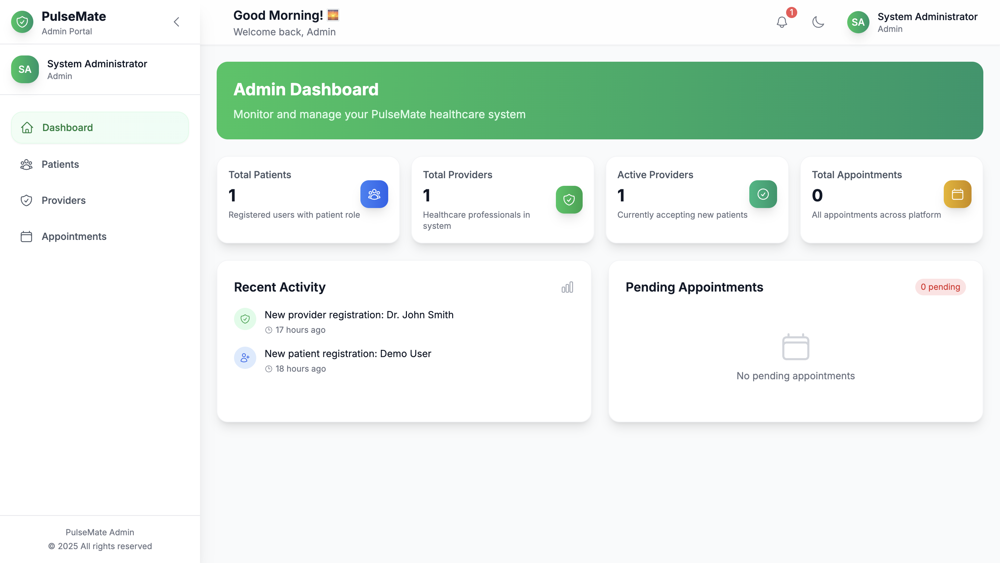
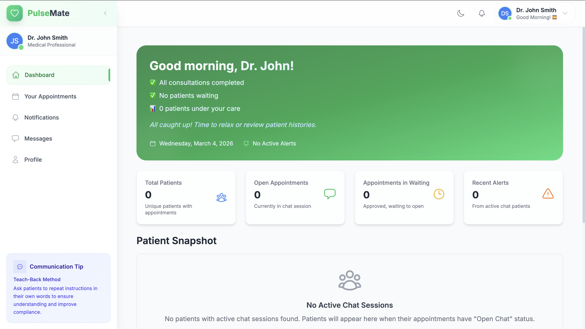
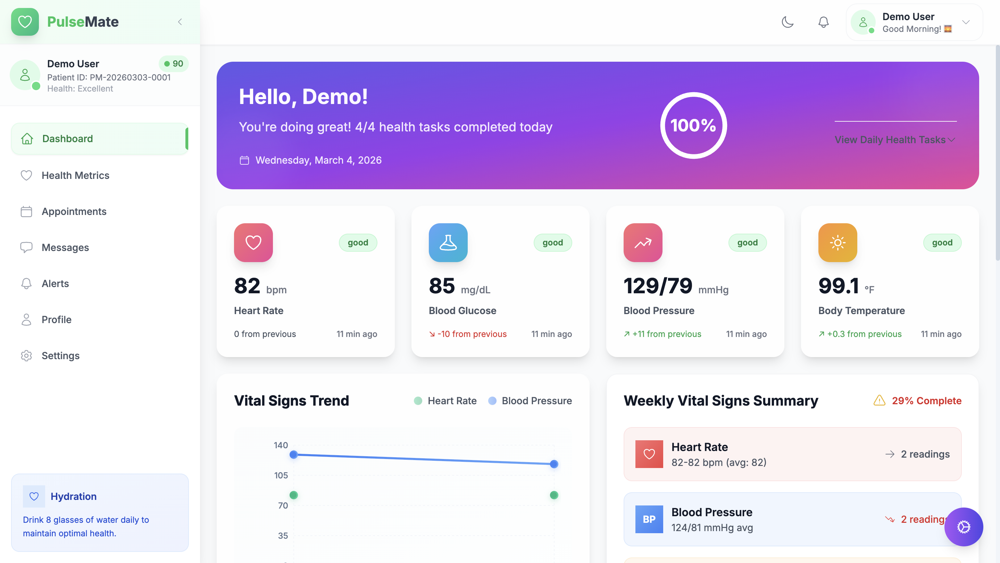

# Pulse-Mate 🩺

A comprehensive health monitoring and medical management platform featuring distinct dashboards for Patients, Doctors, and Administrators.

## Project Structure

The platform is organized into a modular monorepo structure:

- `backend/`: Node.js Express API serving all clients and interacting with MongoDB.
- `patient-health-dashboard/`: React (Vite) frontend for patients to track health metrics and book appointments.
- `doctor-dashboard/`: React (Vite) frontend for doctors to manage patients and consults.
- `admin-dashboard/`: React (Vite) frontend for platform administrators.

## 📸 Dashboards

### Patient Dashboard



### Doctor Dashboard



### Admin Dashboard



### Video Walkthrough

[Watch the Pulse-Mate Demonstration](./demo-video.mp4)

---

## 🚀 Local Development Setup

Follow these instructions to run the entire project locally on your machine.

### Prerequisites

Before you begin, ensure you have the following installed:

1. **Node.js** (v16+ recommended)
2. **MongoDB** (You can run it locally or use a cloud database like MongoDB Atlas)

### 1. Database Configuration

1. Navigate to the `backend/` directory.
2. Create a `.env` file and add your MongoDB connection string.

```env
# backend/.env
MONGO_URI="mongodb://localhost:27017/pulse-mate-new"
JWT_SECRET="your_secure_jwt_secret"
PORT=5001
```

### 2. Install Dependencies

You will need to install dependencies for the backend and all three frontend dashboards.

Run the following command in each of these directories (`backend`, `admin-dashboard`, `doctor-dashboard`, `patient-health-dashboard`):

```bash
npm install
```

### 3. Seed Initial Data

To populate your local database with a demo admin, doctor, and patient, run the seed scripts from the `backend/` directory:

```bash
cd backend
node scripts/createAdminUser.js
node scripts/createDemoDoctor.js
node scripts/createDemoUser.js
```

### 4. Start the Application

You need to run the development servers for all 4 parts of the application simultaneously. Open four separate terminal windows and run:

**Terminal 1 (Backend):**

```bash
cd backend
npm run dev
```

**Terminal 2 (Admin Dashboard):**

```bash
cd admin-dashboard
npm run dev -- --port 3000
```

**Terminal 3 (Doctor Dashboard):**

```bash
cd doctor-dashboard
npm run dev -- --port 3001
```

**Terminal 4 (Patient Dashboard):**

```bash
cd patient-health-dashboard
npm run dev -- --port 3002
```

---

## 🔑 Demo Login Credentials

Once the servers are running, access the dashboards in your browser using these credentials:

| Dashboard | URL                     | Email                | Password  |
| --------- | ----------------------- | -------------------- | --------- |
| Admin     | `http://localhost:3000` | admin@pulsemate.com  | admin123  |
| Doctor    | `http://localhost:3001` | doctor@pulsemate.com | doctor123 |
| Patient   | `http://localhost:3002` | demo@pulsemate.com   | demo123   |

---

## 🔒 Security Note

`node_modules` and `.env` files are ignored via `.gitignore` and **should never be committed to source control**. Keep your secrets safe!
